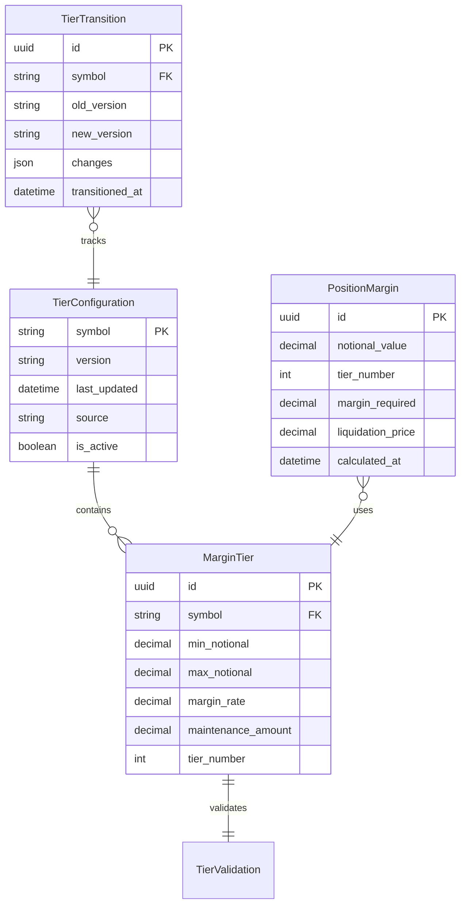

# Data Model: Tiered Margin Enhancement

**Date**: 2025-11-20
**Feature**: Position-based margin tiers with continuity

## Entity Relationship Diagram



## Entity Definitions

### MarginTier

**Purpose**: Represents a single margin tier with continuity guarantees.

```python
from decimal import Decimal
from dataclasses import dataclass
from typing import Optional
from uuid import UUID

@dataclass
class MarginTier:
    """
    Single margin tier with maintenance amount for continuity.

    Invariants:
    - min_notional < max_notional
    - 0 < margin_rate <= 1
    - maintenance_amount >= 0
    - Continuous at boundaries (validated externally)
    """
    id: UUID
    symbol: str
    tier_number: int
    min_notional: Decimal
    max_notional: Decimal
    margin_rate: Decimal
    maintenance_amount: Decimal

    def __post_init__(self):
        # Convert to Decimal if needed
        self.min_notional = Decimal(str(self.min_notional))
        self.max_notional = Decimal(str(self.max_notional))
        self.margin_rate = Decimal(str(self.margin_rate))
        self.maintenance_amount = Decimal(str(self.maintenance_amount))

        # Validate invariants
        assert self.min_notional < self.max_notional, "Invalid tier range"
        assert 0 < self.margin_rate <= 1, "Invalid margin rate"
        assert self.maintenance_amount >= 0, "Invalid maintenance amount"

    def calculate_margin(self, notional: Decimal) -> Decimal:
        """Calculate margin for position within this tier."""
        if not (self.min_notional < notional <= self.max_notional):
            raise ValueError(f"Notional {notional} outside tier range")
        return notional * self.margin_rate - self.maintenance_amount
```

### TierConfiguration

**Purpose**: Collection of tiers for a symbol with versioning.

```python
@dataclass
class TierConfiguration:
    """
    Complete tier configuration for a trading symbol.

    Invariants:
    - Tiers are sorted by min_notional
    - No gaps between tiers
    - Continuous at all boundaries
    - At least one tier exists
    """
    symbol: str
    version: str
    last_updated: datetime
    source: str  # 'binance', 'manual', etc.
    is_active: bool
    tiers: List[MarginTier]

    def __post_init__(self):
        self._validate_configuration()

    def _validate_configuration(self):
        """Validate tier configuration completeness and continuity."""
        if not self.tiers:
            raise ValueError("Configuration must have at least one tier")

        # Sort tiers
        self.tiers.sort(key=lambda t: t.min_notional)

        # Check for gaps
        for i in range(len(self.tiers) - 1):
            if self.tiers[i].max_notional != self.tiers[i + 1].min_notional:
                raise ValueError(f"Gap between tier {i} and {i+1}")

        # Validate continuity
        for i in range(len(self.tiers) - 1):
            if not self._check_continuity(self.tiers[i], self.tiers[i + 1]):
                raise ValueError(f"Discontinuity at tier {i}/{i+1} boundary")

    def _check_continuity(self, tier1: MarginTier, tier2: MarginTier) -> bool:
        """Check mathematical continuity at tier boundary."""
        boundary = tier1.max_notional
        margin1 = boundary * tier1.margin_rate - tier1.maintenance_amount
        margin2 = boundary * tier2.margin_rate - tier2.maintenance_amount
        return abs(margin1 - margin2) < Decimal('0.01')  # Within 1 cent

    def get_tier(self, notional: Decimal) -> MarginTier:
        """Get appropriate tier for notional value."""
        for tier in self.tiers:
            if tier.min_notional < notional <= tier.max_notional:
                return tier
        # Handle edge case for values above max tier
        if notional > self.tiers[-1].max_notional:
            return self.tiers[-1]
        raise ValueError(f"No tier found for notional {notional}")
```

### PositionMargin

**Purpose**: Calculated margin for a specific position.

```python
@dataclass
class PositionMargin:
    """
    Margin calculation result for a position.

    Stores calculation details for audit trail.
    """
    id: UUID
    notional_value: Decimal
    tier_number: int
    tier_applied: MarginTier
    margin_required: Decimal
    margin_rate_effective: Decimal
    liquidation_price: Decimal
    calculated_at: datetime
    configuration_version: str

    @classmethod
    def calculate(cls, notional: Decimal, price: Decimal, leverage: Decimal,
                  config: TierConfiguration) -> 'PositionMargin':
        """Calculate margin for a position."""
        tier = config.get_tier(notional)
        margin_required = tier.calculate_margin(notional)
        margin_rate_effective = margin_required / notional

        # Liquidation price formula
        # Long: L = P × (1 - 1/λ + margin_rate/λ)
        liquidation_price = price * (1 - Decimal('1')/leverage +
                                      margin_rate_effective/leverage)

        return cls(
            id=uuid4(),
            notional_value=notional,
            tier_number=tier.tier_number,
            tier_applied=tier,
            margin_required=margin_required,
            margin_rate_effective=margin_rate_effective,
            liquidation_price=liquidation_price,
            calculated_at=datetime.utcnow(),
            configuration_version=config.version
        )
```

### TierTransition

**Purpose**: Audit trail for tier configuration changes.

```python
@dataclass
class TierTransition:
    """
    Tracks changes to tier configurations.

    Used for audit trail and rollback capability.
    """
    id: UUID
    symbol: str
    old_version: str
    new_version: str
    changes: Dict[str, Any]
    transitioned_at: datetime
    triggered_by: str  # 'auto_sync', 'manual', etc.

    def describe_changes(self) -> str:
        """Human-readable description of changes."""
        descriptions = []
        for tier_num, change in self.changes.items():
            if 'margin_rate' in change:
                descriptions.append(
                    f"Tier {tier_num}: rate {change['margin_rate']['old']} → "
                    f"{change['margin_rate']['new']}"
                )
            if 'maintenance_amount' in change:
                descriptions.append(
                    f"Tier {tier_num}: MA ${change['maintenance_amount']['old']} → "
                    f"${change['maintenance_amount']['new']}"
                )
        return "; ".join(descriptions)
```

## State Transitions

### TierConfiguration States

```
[Draft] --validate--> [Active]
   ^                      |
   |                      v
   +<----rollback---- [Deprecated]
```

### Validation Rules

```python
class TierValidator:
    """Validates tier configurations before activation."""

    @staticmethod
    def validate_continuity(config: TierConfiguration) -> bool:
        """Ensure continuity at all boundaries."""
        for i in range(len(config.tiers) - 1):
            boundary = config.tiers[i].max_notional
            margin1 = config.tiers[i].calculate_margin(boundary)
            margin2 = config.tiers[i + 1].calculate_margin(boundary)
            if abs(margin1 - margin2) > Decimal('0.01'):
                return False
        return True

    @staticmethod
    def validate_coverage(config: TierConfiguration) -> bool:
        """Ensure tiers cover full range."""
        if config.tiers[0].min_notional != 0:
            return False
        if config.tiers[-1].max_notional != Decimal('Infinity'):
            return False
        return True

    @staticmethod
    def validate_monotonicity(config: TierConfiguration) -> bool:
        """Ensure margin rates are non-decreasing."""
        for i in range(len(config.tiers) - 1):
            if config.tiers[i].margin_rate > config.tiers[i + 1].margin_rate:
                return False
        return True
```

## Database Schema (DuckDB)

```sql
-- Tier configurations (versioned)
CREATE TABLE tier_configurations (
    symbol VARCHAR PRIMARY KEY,
    version VARCHAR NOT NULL,
    last_updated TIMESTAMP NOT NULL,
    source VARCHAR NOT NULL,
    is_active BOOLEAN DEFAULT true,
    tiers JSON NOT NULL,  -- Array of tier objects
    CHECK (json_array_length(tiers) > 0)
);

-- Individual tiers (denormalized for query performance)
CREATE TABLE margin_tiers (
    id UUID PRIMARY KEY,
    symbol VARCHAR NOT NULL,
    tier_number INTEGER NOT NULL,
    min_notional DECIMAL(20, 2) NOT NULL,
    max_notional DECIMAL(20, 2),
    margin_rate DECIMAL(8, 6) NOT NULL,
    maintenance_amount DECIMAL(20, 2) NOT NULL,
    UNIQUE(symbol, tier_number),
    CHECK (min_notional < max_notional),
    CHECK (margin_rate > 0 AND margin_rate <= 1),
    CHECK (maintenance_amount >= 0)
);

-- Calculation audit trail
CREATE TABLE position_margins (
    id UUID PRIMARY KEY,
    notional_value DECIMAL(20, 2) NOT NULL,
    tier_number INTEGER NOT NULL,
    margin_required DECIMAL(20, 2) NOT NULL,
    liquidation_price DECIMAL(20, 8) NOT NULL,
    calculated_at TIMESTAMP NOT NULL,
    configuration_version VARCHAR NOT NULL
);

-- Configuration change history
CREATE TABLE tier_transitions (
    id UUID PRIMARY KEY,
    symbol VARCHAR NOT NULL,
    old_version VARCHAR NOT NULL,
    new_version VARCHAR NOT NULL,
    changes JSON NOT NULL,
    transitioned_at TIMESTAMP NOT NULL,
    triggered_by VARCHAR NOT NULL
);

-- Indexes for performance
CREATE INDEX idx_tiers_symbol ON margin_tiers(symbol);
CREATE INDEX idx_tiers_notional ON margin_tiers(symbol, min_notional, max_notional);
CREATE INDEX idx_margins_calculated ON position_margins(calculated_at);
CREATE INDEX idx_transitions_symbol ON tier_transitions(symbol, transitioned_at);
```

## API Integration

### Input Validation (Pydantic)

```python
from pydantic import BaseModel, Field, validator

class MarginCalculationRequest(BaseModel):
    notional: Decimal = Field(..., gt=0, le=10**12)
    symbol: str = Field(default="BTCUSDT")
    price: Optional[Decimal] = Field(None, gt=0)
    leverage: Optional[Decimal] = Field(None, ge=1, le=125)

    @validator('notional', 'price', 'leverage', pre=True)
    def coerce_to_decimal(cls, v):
        return Decimal(str(v)) if v is not None else v

class TierUpdateRequest(BaseModel):
    symbol: str
    tiers: List[Dict[str, Any]]
    source: str = "manual"

    @validator('tiers')
    def validate_tier_structure(cls, v):
        required_fields = {'min_notional', 'max_notional',
                           'margin_rate', 'maintenance_amount'}
        for tier in v:
            if not required_fields.issubset(tier.keys()):
                raise ValueError("Missing required tier fields")
        return v
```

## Migration Strategy

```sql
-- Migration to add maintenance_amount column
ALTER TABLE margin_tiers
ADD COLUMN maintenance_amount DECIMAL(20, 2) DEFAULT 0;

-- Update existing tiers with calculated MA values
UPDATE margin_tiers SET maintenance_amount = CASE
    WHEN tier_number = 1 THEN 0
    WHEN tier_number = 2 THEN 250
    WHEN tier_number = 3 THEN 4000
    WHEN tier_number = 4 THEN 29000
    ELSE 29000
END;

-- Make column required
ALTER TABLE margin_tiers
ALTER COLUMN maintenance_amount SET NOT NULL;
```

## Next Steps

1. Generate API contracts (contracts/tier-api.yaml)
2. Create quickstart testing guide
3. Regenerate tasks.md with proper granularity
4. Implement with TDD approach (continuity tests first)